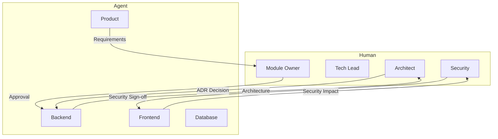
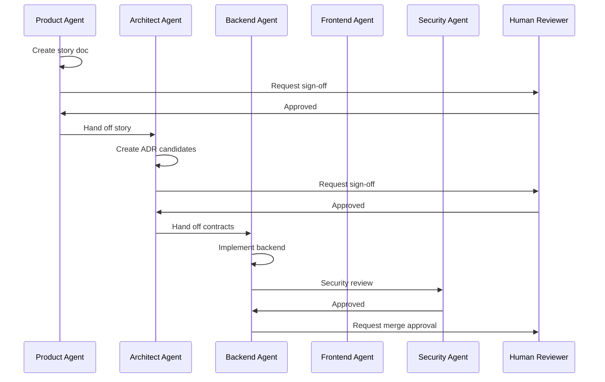
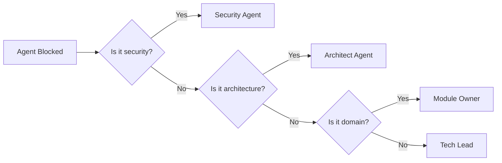

# AI Agent Collaboration Rules

> How AI agents coordinate without conflicting decisions.

This document defines how multiple AI agents work together on a single feature without stepping on each other's toes, creating contradictory changes, or losing context. The core principle is **clear authority boundaries** with structured handoffs.

---

## The Handbook as Shared Context

Every AI agent operates from the same source of truth: **this handbook**. Before any agent begins work, it must read the relevant sections:

| Agent | Required Reading |
|---|---|
| Product Agent | Vision, Principles, Feature Workflow |
| Architect Agent | Architecture docs, Module boundaries, ADRs |
| Backend Agent | Backend structure, API design, Coding standards |
| Frontend Agent | Frontend structure, Component patterns, Accessibility |
| Database Agent | Schema design, Migrations, Naming standards |
| Security Agent | Security overview, OWASP, Auth model |
| QA Agent | Testing pyramid, BDD, Test patterns |
| Performance Agent | Performance budgets, Caching, Profiling |
| DevOps Agent | CI/CD, Deployments, Monitoring |
| Documentation Agent | Conventions, Module docs |
| Code Review Agent | Code review checklist, Quality gates |

> **Rule** — No agent proceeds without confirming it has read the relevant handbook sections. This is verified in the PR template.

---

## Decision Authority Matrix

Each decision type has a clear owner. Agents must not make decisions outside their authority:



### Authority by Decision Type

| Decision | Authority | Consultation Required |
|---|---|---|
| Feature scope | Product Agent | Module Owner |
| API contract (new) | Architect Agent | Backend Agent |
| Database schema | Architect Agent | Database Agent |
| Authentication flow | Security Agent | Architect |
| UI component library | Frontend Lead | None |
| Test strategy | QA Agent | None |
| Performance budget | Performance Agent | Architect |
| Deployment strategy | DevOps Agent | None |
| Documentation structure | Documentation Agent | None |

---

## Conflict Resolution

When agents produce conflicting decisions, the following resolution order applies:

### 1. Architectural Conflicts

**Scenario:** Backend Agent and Database Agent disagree on schema design.

**Resolution:**
1. Both agents document their reasoning in the PR
2. Architect Agent reviews both positions
3. Architect makes final decision
4. Decision is recorded in an ADR if precedent-setting

### 2. API Contract Conflicts

**Scenario:** Frontend Agent expects `PATCH /bookings/{id}` but Backend Agent implemented `PUT`.

**Resolution:**
1. Reference the [API Design](../08-apis/rest-design.md) standards
2. If standards are ambiguous, Architect resolves
3. Frontend Agent adapts to contract (contract is source of truth)

### 3. Security Conflicts

**Scenario:** Backend Agent removes rate limiting for convenience; Security Agent flags it.

**Resolution:**
1. Security Agent decision is **final** for security-related matters
2. Backend Agent must comply or escalate to Security Lead
3. No "override" allowed for security findings

### 4. Test Strategy Conflicts

**Scenario:** Backend Agent writes unit tests; QA Agent says integration tests are needed.

**Resolution:**
1. QA Agent defines the test coverage requirements
2. Backend Agent implements required tests
3. If test feasibility is disputed, Tech Lead decides

---

## Sign-off Requirements

Each agent produces artifacts that require sign-off before the next agent proceeds:



### Sign-off Matrix

| Artifact | Signed Off By | Can Proceed |
|---|---|---|
| Story document | Product Owner + Module Owner | Architect Agent |
| ADR candidate | Architect | Backend Agent |
| API contract | Backend Lead + Frontend Lead | Implementation |
| Database migration | Database Agent + Backend Lead | Integration tests |
| Security findings | Security Agent | Merge |
| Test suite | QA Agent | Release |
| Performance report | Performance Agent | Deploy |
| Documentation | Documentation Agent | Publish |

---

## Handoff Protocol

When one agent hands off to another, it must provide:

1. **Context summary** — What was done, why
2. **Artifacts produced** — Files created/modified
3. **Open questions** — Unresolved items requiring decision
4. **Constraints** — Non-negotiable requirements
5. **Related artifacts** — Links to ADRs, specs, prior PRs

Example handoff from Product Agent to Architect Agent:

```markdown
## Handoff: Membership Freeze Feature

### Context
Splashh operators need the ability to temporarily freeze member accounts
during facility closures (e.g., holidays, renovations) without cancelling
the membership.

### What Was Produced
- Story document: `docs/stories/membership-freeze.md`
- Initial user stories:
  - As an operator, I can freeze a membership for X days
  - As a member, I can see my frozen status in my dashboard
  - As a system, I auto-unfreeze after the freeze period

### Open Questions
- Maximum freeze duration? (Operator limit vs. Plan tier)
- Should frozen members count toward capacity?
- Freeze pricing (free vs. reduced rate)?

### Constraints
- Must work with existing billing system
- Cannot change subscription dates (just pause)
- Multi-tenant: each tenant has own settings

### Related Artifacts
- [ADR-0003: Multi-tenant Strategy](../17-adrs/0003-multi-tenant-strategy.md)
- [Membership Module Docs](../18-modules/membership.md)
```

---

## Escalation Path

When an agent cannot proceed due to ambiguity, conflict, or blocked decision:



> **Rule** — Agents must not wait indefinitely. If a decision is blocked for more than 1 business day, the agent must escalate to the appropriate human.

---

## Anti-patterns

### 1. Agent Bypass

**Anti-pattern:** Agent skips sign-off and proceeds to implementation.

**Prevention:** CI checks for required approval labels.

### 2. Context Hoarding

**Anti-pattern:** Agent keeps all context in memory without writing it down.

**Prevention:** Every handoff must produce written documentation.

### 3. Scope Creep

**Anti-pattern:** Agent expands scope beyond original requirements.

**Prevention:** Product Agent defines scope; any expansion requires re-approval.

### 4. Circular Dependencies

**Anti-pattern:** Agent A waits for Agent B, who waits for Agent A.

**Prevention:** Architect Agent breaks circular dependencies.

---

## Related Documents

- [Feature Development Workflow](../15-workflows/feature-development.md)
- [Product Agent](./agent-product.md)
- [Architect Agent](./agent-architect.md)
- [Code Review Agent](./agent-code-review.md)
