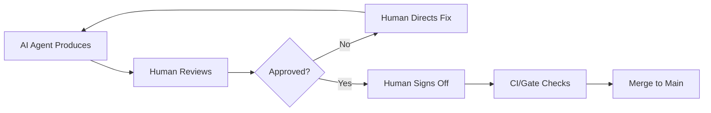

# AI-Driven Development Overview

> How AI agents fit into our engineering workflow — and where they do not.

This document establishes the foundation for how human engineers and AI coding agents collaborate on the Splashh Sports Platform. We treat AI agents as **specialized team members** with defined responsibilities, clear boundaries, and explicit sign-off requirements.

---

## What We Use AI For

AI agents excel at well-bounded, repetitive, and mechanically tedious tasks. We delegate the following to AI agents:

| Task Category | Examples | Why AI |
|---|---|---|
| **Boilerplate** | CRUD endpoints, form components, test scaffolds | High volume, low variance, error-prone when done manually |
| **Test generation** | Unit tests from domain models, integration test stubs | Mechanical transformation from code to test |
| **Refactoring** | Rename refactors, extract methods, inline helpers | Mechanical, reversible, easily verifiable |
| **Documentation** | API docstrings, README updates, diagram generation | Repetitive, follows templates |
| **Code search** | Finding similar patterns, locating usage sites | Fast traversal of large codebases |
| **Migration assistance** | SQLAlchemy model updates, schema migrations | Pattern-based transformations |

---

## What We Do NOT Use AI For

AI agents lack business context, institutional knowledge, and judgment about trade-offs. The following are **human-only decisions**:

| Task Category | Examples | Why Human |
|---|---|---|
| **Architectural decisions** | New modules, service boundaries, data models | Requires understanding of business domain, scale projections, team capabilities |
| **Security-critical code** | Authentication, authorization, encryption, secrets handling | High blast radius of errors; requires deep security knowledge |
| **Business logic** | Pricing rules, booking policies, membership terms | Must align with business goals and legal requirements |
| **Incident response** | Outages, data breaches, critical bugs | Requires judgment, communication, accountability |
| **Code ownership decisions** | Who reviews what, module ownership | Organizational context |
| **Trade-off analysis** | Technology choices, build vs. buy | Requires experience, market awareness |

> **Rule** — Any PR that touches authentication, authorization, payment processing, or PII handling must be reviewed and approved by a human security specialist. AI review comments are advisory only.

---

## Human-in-the-Loop Requirements

Every feature that touches production systems follows the **Human-in-the-Loop (HITL)** model:



### Required Human Sign-offs

| Change Type | Minimum Sign-offs |
|---|---|
| New endpoint (non-sensitive) | 1 senior engineer |
| Changes to existing endpoint | 1 engineer |
| Security, auth, payment code | 1 security engineer + 1 engineer |
| Architecture / ADR changes | Architect + Tech Lead |
| Module creation | Architect |
| Database migrations | Backend Lead |
| UI/UX changes | Product + Engineer |

---

## Code Ownership

AI-generated code carries the same ownership and accountability as human-written code.

> **Rule** — The PR author (human) is responsible for AI-generated code. This includes correctness, security, and maintainability.

### Ownership Model

- **Author** — The human who opens the PR. Responsible for understanding every line, answering review questions, and ensuring the code meets requirements.
- **Reviewer** — Human who approves the PR. Must verify AI-generated code meets standards, not just run tests.
- **Module Owner** — The designated owner of a module (per [Modules](../18-modules/README.md)). Must be consulted for changes to their module.
- **AI Agent** — Not a legal entity. The agent's "identity" is logged in PR comments for audit purposes.

---

## Agent Identity and Attribution

Every AI agent interaction is logged with sufficient context for audit:

```markdown
<!--
agent: claude-code
model: claude-opus-4-6
task: generate unit tests for booking/aggregates.py
prompt: [truncated]
-->
```

This enables:
- Tracing which agent produced what code
- Reproducing agent outputs for debugging
- Understanding decision context during review

---

## Collaboration Framework

AI agents do not work in isolation. Each agent operates within a **collaboration framework** that defines:

1. **Inputs** — What the agent receives (requirements, specs, context)
2. **Outputs** — What the agent produces (code, docs, tests)
3. **Delegates To** — Which other agents the agent can call
4. **Escalates To** — Which human or agent to escalate unresolved questions

See [Collaboration Rules](./collaboration.md) for the detailed interaction model.

---

## Failure Modes

AI agents are prone to specific failure modes that human reviewers must catch:

| Failure Mode | Symptom | Mitigation |
|---|---|---|
| **Hallucination** | Agent invents APIs, libraries, or facts | Require links to sources; verify against handbook |
| **Context loss** | Agent forgets requirements mid-task | Break tasks into smaller steps; verify at each step |
| **Over-generation** | Agent builds more than needed | Scope tightly; reject out-of-scope additions |
| **Security blind spots** | Agent misses OWASP issues | Mandatory human security review for sensitive code |
| **Test fragility** | Agent writes brittle, overly-specific tests | Reviewer validates test maintainability |

---

## Related Documents

- [Collaboration Rules](./collaboration.md) — How agents coordinate without conflicts
- [Feature Development Workflow](../15-workflows/feature-development.md) — End-to-end workflow with agent integration
- [Quality Gates Overview](../16-quality-gates/overview.md) — Automated enforcement
- [Code Review Workflow](../15-workflows/code-review.md) — Human review process
