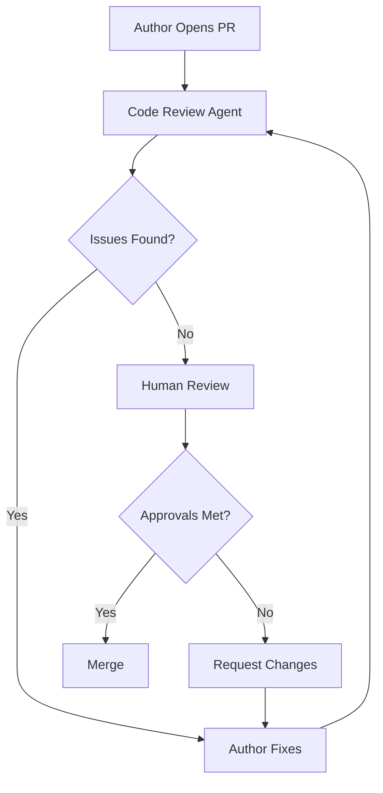

# Code Review Workflow

> How we review code — process, etiquette, and standards.

This document defines our code review process, ensuring consistent, high-quality reviews that improve code and share knowledge.

---

## Overview



---

## Review Requirements

| Change Type | Required Approvals | Review SLA |
|---|---|---|
| Bug fix (<10 lines) | 1 engineer | 4 hours |
| New feature (non-critical) | 1 senior engineer | 1 business day |
| Security, auth, payment | 1 security + 1 engineer | 1 business day |
| Architecture / ADR | Architect + Tech Lead | 2 business days |
| Module creation | Architect + Module Owner | 2 business days |

---

## PR Title Convention

Format: `<type>(<scope>): <description>`

| Type | Description |
|---|---|
| `feat` | New feature |
| `fix` | Bug fix |
| `refactor` | Code change that neither fixes nor adds |
| `docs` | Documentation only |
| `test` | Adding or updating tests |
| `chore` | Build, tooling, dependencies |
| `perf` | Performance improvement |

Examples:
```
feat(membership): add membership freeze feature
fix(booking): resolve double-booking race condition
refactor(payments): extract payment calculation to service
docs(api): document new booking endpoints
```

---

## PR Description Template

```markdown
## Summary
Brief description of what this PR does.

## Changes
- Change 1
- Change 2
- Change 3

## Testing
- [ ] Unit tests added/updated
- [ ] Integration tests pass
- [ ] Manual testing performed (if applicable)

## Checklist
- [ ] Self-reviewed code
- [ ] No console.log / print statements
- [ ] No hardcoded values
- [ ] Type hints added
- [ ] Docs updated

## Related Issues
Closes #123
```

---

## Review Etiquette

### For Reviewers

> **Guideline** — Be kind, specific, and constructive.

| Do | Don't |
|---|---|
| Point to the specific line | Vague comments like "this is bad" |
| Suggest a fix, not just a problem | Demand changes without explanation |
| Ask questions | Make demands |
| Acknowledge good code | Focus only on negatives |
| Review within SLA | Delay reviews indefinitely |

### For Authors

> **Guideline** — Respond promptly and professionally.

| Do | Don't |
|---|---|
| Address all comments | Ignore comments |
| Explain your reasoning | Get defensive |
| Re-request review after fixes | Abandon PR |
| Keep PRs small | Dump massive changes |

---

## Review Checklist

### Code Quality

- [ ] Code follows style guidelines
- [ ] Type hints are present
- [ ] No hardcoded values
- [ ] No commented-out code
- [ ] No console.log / print statements

### Functionality

- [ ] Logic is correct
- [ ] Edge cases handled
- [ ] Error handling present
- [ ] Logging appropriate

### Testing

- [ ] Tests are present
- [ ] Tests are meaningful
- [ ] Tests are not brittle

### Security

- [ ] No secrets in code
- [ ] Input validation present
- [ ] Authentication/authorization correct

### Documentation

- [ ] Docstrings present
- [ ] Complex logic commented

---

## Common Review Pitfalls

| Pitfall | Description | Solution |
|---|---|---|
| **Bike-shedding** | Focusing on trivial issues | Prioritize logic and correctness first |
| **Ghosting** | Not reviewing or responding | Respect SLAs |
| **Rubber-stamping** | Approving without review | Take time to understand changes |
| **Mega-PRs** | Reviewing 1000+ lines | Split into smaller PRs |
| **Personal style** | Enforcing personal preferences | Follow team conventions |

---

## Handling Disagreements

### Resolution Steps

1. **Discuss**: Talk through the issue (call or async)
2. **Escalate**: If unresolved, escalate to Tech Lead
3. **Arbitrate**: Tech Lead makes final decision
4. **Document**: If significant, create ADR

> **Rule** — Security findings are not subject to disagreement. Security Agent decision is final.

---

## Automated Checks

The following run automatically on every PR:

| Check | Tool | Fail Condition |
|---|---|---|
| Lint | Ruff | Errors |
| Type Check | MyPy | Errors |
| Unit Tests | pytest | Failures |
| Security Scan | Bandit | Critical/High |
| Secrets Scan | TruffleHog | Findings |

---

## Related Documents

- [Code Review Checklist](../13-coding-standards/code-review-checklist.md)
- [Quality Gates Overview](../16-quality-gates/overview.md)
- [PR Gates](../16-quality-gates/pr-gates.md)
