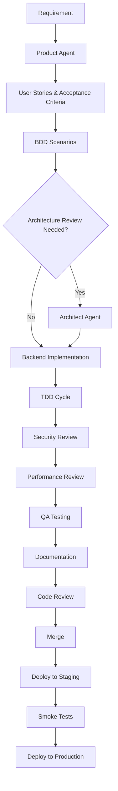
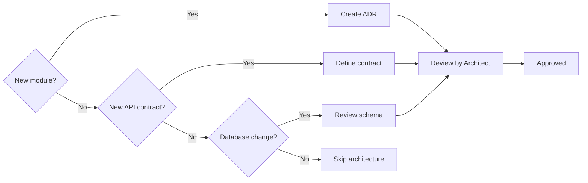
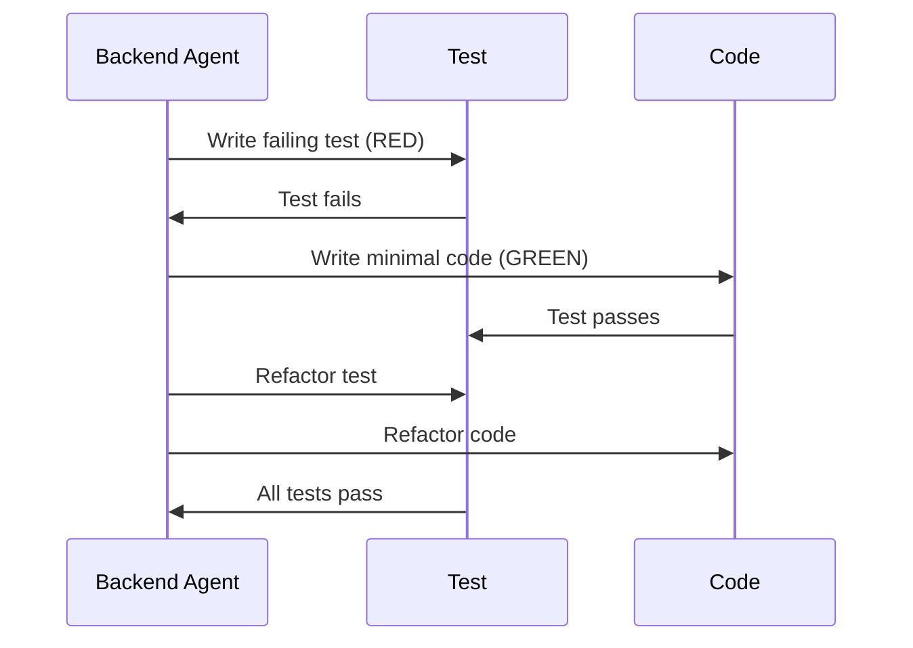

# Feature Development Workflow

> End-to-end workflow from requirement to deployment.

This document describes the complete workflow for developing a feature, including all steps, checklists, and handoffs between agents and humans.

---

## Overview

---

## Step 1: Requirement

| Item | Description |
|---|---|
| Input | Business goal, customer feedback, bug report |
| Owner | Product Owner |
| Output | Requirement document |

**Checklist:**
- [ ] Clear business goal defined
- [ ] Expected impact quantified (revenue, user satisfaction, cost savings)
- [ ] Priority assigned (P0-P3)
- [ ] Timeline expectations set

---

## Step 2: Product Agent - User Stories & Acceptance Criteria

| Item | Description |
|---|---|
| Input | Requirement document |
| Owner | Product Agent |
| Output | Story document |

**Checklist:**
- [ ] User stories follow Actor/Action/Benefit format
- [ ] Acceptance criteria are measurable (pass/fail)
- [ ] Edge cases identified
- [ ] Dependencies documented
- [ ] Peer reviewed by Product Owner

> See [Product Agent](../14-ai-driven-development/agent-product.md)

---

## Step 3: BDD Scenarios

| Item | Description |
|---|---|
| Input | Story document |
| Owner | Product Agent |
| Output | Gherkin `.feature` files |

**Checklist:**
- [ ] Happy path covered
- [ ] Error paths covered
- [ ] Edge cases covered
- [ ] Gherkin syntax valid (`behave --dry-run`)
- [ ] Scenario names are descriptive

---

## Step 4: Architecture Review

| Item | Description |
|---|---|
| Input | Story document, BDD scenarios |
| Owner | Architect Agent |
| Output | Architecture review, ADR if needed |

**Decision Tree:**

**Checklist:**
- [ ] Module boundaries respected
- [ ] API contract defined
- [ ] Database schema reviewed
- [ ] Security boundaries identified
- [ ] Performance implications noted

> See [Architect Agent](../14-ai-driven-development/agent-architect.md)

---

## Step 5: Backend Implementation (TDD Cycle)

| Item | Description |
|---|---|
| Input | Architecture review, API contract |
| Owner | Backend Agent |
| Output | Implementation with tests |

### TDD Cycle

**Checklist:**
- [ ] Tests written first (TDD)
- [ ] Domain logic tested in isolation
- [ ] Integration tests for database interactions
- [ ] API tests for endpoints
- [ ] Migrations generated
- [ ] Lint passes
- [ ] Type check passes

> See [Backend Agent](../14-ai-driven-development/agent-backend.md)

---

## Step 6: Security Review

| Item | Description |
|---|---|
| Input | PR changes |
| Owner | Security Agent |
| Output | Security review findings |

**Checklist:**
- [ ] SAST scan passes (Bandit, Semgrep)
- [ ] Secrets scan passes (TruffleHog)
- [ ] Dependencies scanned (Safety, Dependabot)
- [ ] Authentication required
- [ ] Authorization enforced
- [ ] Input validation present
- [ ] No PII in logs

> See [Security Agent](../14-ai-driven-development/agent-security.md)

---

## Step 7: Performance Review

| Item | Description |
|---|---|
| Input | PR changes |
| Owner | Performance Agent |
| Output | Performance report |

**Checklist:**
- [ ] Bundle size within budget
- [ ] API latency within budget
- [ ] Database queries optimized
- [ ] No N+1 queries

> See [Performance Agent](../14-ai-driven-development/agent-performance.md)

---

## Step 8: QA Testing

| Item | Description |
|---|---|
| Input | Implementation, BDD scenarios |
| Owner | QA Agent |
| Output | Test execution report |

**Checklist:**
- [ ] BDD scenarios executed
- [ ] Integration tests pass
- [ ] E2E tests pass
- [ ] Regression suite passes
- [ ] Manual testing (if needed)

> See [QA Agent](../14-ai-driven-development/agent-qa.md)

---

## Step 9: Documentation

| Item | Description |
|---|---|
| Input | Implementation changes |
| Owner | Documentation Agent |
| Output | Updated docs |

**Checklist:**
- [ ] API docs updated
- [ ] Module docs updated (if new features)
- [ ] README updated (if needed)
- [ ] Examples added/runnable

> See [Documentation Agent](../14-ai-driven-development/agent-documentation.md)

---

## Step 10: Code Review

| Item | Description |
|---|---|
| Input | Complete implementation |
| Owner | Human reviewers |
| Output | Approved PR |

**Checklist:**
- [ ] 2 approvals for non-trivial changes
- [ ] All comments addressed
- [ ] CI pipeline green
- [ ] PR title follows convention

> See [Code Review Workflow](./code-review.md)

---

## Step 11-13: Merge & Deploy

| Step | Owner | Description |
|---|---|---|
| Merge | Author | Merge to main after approvals |
| Deploy to Staging | DevOps | Automatic or manual deploy |
| Smoke Tests | QA | Verify basic functionality |

**Checklist:**
- [ ] Merge commit is green
- [ ] Staging deployment succeeds
- [ ] Smoke tests pass
- [ ] Monitoring looks healthy

---

## Step 14: Deploy to Production

| Item | Description |
|---|---|
| Owner | Tech Lead / DevOps |
| Approval | Required for production |

**Checklist:**
- [ ] Release notes prepared
- [ ] Rollback plan documented
- [ ] On-call notified
- [ ] Deploy during approved window

---

## Detailed Checklist Summary

| Phase | Automated Checks | Manual Checks |
|---|---|---|
| Product | — | Story review |
| Architecture | Architecture tests | ADR review |
| Implementation | Unit tests, lint, type | Test review |
| Security | SAST, secrets scan | Security review |
| Performance | Bundle size, query analysis | — |
| QA | Integration tests | Manual testing |
| Docs | Link check | Content review |
| Review | CI pipeline | Human approval |
| Deploy | Health checks | Smoke tests |

---

## Related Documents

- [Code Review Workflow](./code-review.md)
- [Incident Response](./incident-response.md)
- [Quality Gates Overview](../16-quality-gates/overview.md)
- [TDD Handbook](../10-testing/tdd-handbook.md)
