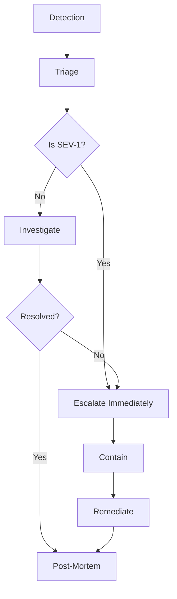
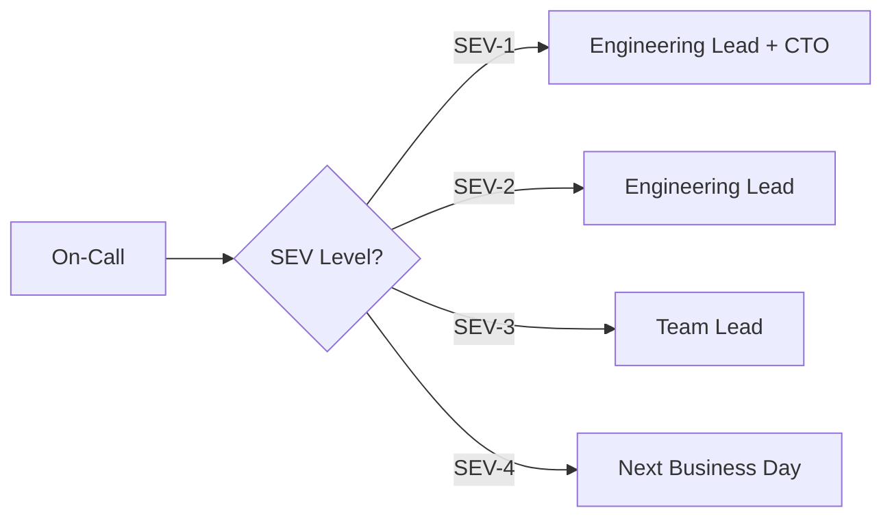

# Incident Response Workflow

> On-call, escalation, severity levels, and post-mortem process.

This document defines how we detect, respond to, and learn from incidents. It ensures consistent, effective incident management with minimal customer impact.

---

## Overview



---

## Severity Levels

| Severity | Definition | Response Time | Examples |
|---|---|---|---|
| **SEV-1** | Complete outage, data loss, security breach | 15 minutes | Database down, all services unreachable, data breach |
| **SEV-2** | Major feature unavailable, degraded performance | 30 minutes | Payment processing down, booking API failing |
| **SEV-3** | Minor feature broken, workaround available | 4 hours | Email notifications delayed, reporting slow |
| **SEV-4** | Cosmetic issue, low impact | Next business day | UI glitch, typo in email |

---

## On-Call Rotation

| Role | Responsibility |
|---|---|
| **Primary On-Call** | First responder, initial triage |
| **Secondary On-Call** | Backup if primary unavailable |
| **Engineering Lead** | Escalation point for SEV-1/2 |
| **Security Lead** | Escalation for security incidents |

### Rotation Schedule
- Weekly rotation (Monday 00:00 - Sunday 23:59)
- Primary and secondary rotate weekly
- Handoff meeting on Monday

---

## Escalation Path



### Escalation Triggers
- Root cause unknown after 30 minutes
- Customer impact > 100 users
- Data integrity concern
- Security breach confirmed

---

## Communication Templates

### Incident Declaration

```
**Incident Declared**
Severity: SEV-[1/2/3/4]
Title: [Brief description]
Status: Investigating
Primary: [Name]
Impact: [Number] users affected
ETA: [Estimated resolution time]
```

### Status Update (Every 30 minutes for SEV-1/2)

```
**Status Update** - [Time]
Status: [Investigating/Identified/Monitoring/Resolved]
What changed: [Brief update]
Next update: [Time]
```

### Incident Resolution

```
**Incident Resolved**
Time: [Duration]
Root cause: [Brief explanation]
Impact: [Summary]
Next steps: [Any follow-up needed]
```

---

## Response Process

### Step 1: Detection
- Automated alerts (monitoring)
- Customer reports (support)
- Internal reports (team)

### Step 2: Triage
1. Confirm incident exists
2. Assess severity
3. Determine impact scope
4. Assign primary responder

### Step 3: Containment
1. Stop bleeding (disable feature, rollback)
2. Isolate affected systems
3. Preserve evidence for investigation

### Step 4: Remediation
1. Fix root cause
2. Verify fix works
3. Deploy to production

### Step 5: Post-Mortem
1. Document timeline
2. Identify root cause
3. Identify contributing factors
4. Define action items
5. Share learnings

---

## Post-Mortem Template

```markdown
# Post-Mortem: [Incident Title]

## Summary
[Brief overview of incident]

## Timeline (UTC)
- [Time] - Issue detected
- [Time] - Incident declared
- [Time] - Root cause identified
- [Time] - Fix deployed
- [Time] - Incident resolved

## Impact
- Users affected: [Number]
- Duration: [Time]
- Data loss: [Yes/No]
- Revenue impact: [Estimate]

## Root Cause
[Technical explanation]

## Contributing Factors
1. [Factor 1]
2. [Factor 2]

## Action Items
| ID | Description | Owner | Due Date |
|---|---|---|---|
| 1 | [Action] | [Name] | [Date] |
| 2 | [Action] | [Name] | [Date] |

## Lessons Learned
1. [What went well]
2. [What could improve]
```

---

## Runbooks

| Scenario | Runbook |
|---|---|
| Database high CPU | `runbooks/db-high-cpu.md` |
| High error rate | `runbooks/high-error-rate.md` |
| Slow API | `runbooks/slow-api.md` |
| Memory leak | `runbooks/memory-leak.md` |
| Security breach | `runbooks/security-breach.md` |

---

## Related Documents

- [Monitoring](../12-devops/monitoring.md)
- [Incident Response (Security)](../09-security/incident-response.md)
- [Disaster Recovery](../02-architecture/disaster-recovery.md)
- [On-Call Guide](./on-call-guide.md) — Internal wiki
