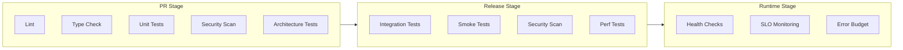

# Quality Gates Overview

> Philosophy, stages, and enforcement of quality gates.

Quality gates are **automated checkpoints** that prevent defective code from advancing through the development pipeline. A gate is only as good as its enforcement — if it can be bypassed, it's not a gate.

---

## Philosophy

### Shift-Left

We enforce quality as early as possible in the development cycle. Finding bugs in CI is 10x cheaper than in production.

### Automation

Every gate runs automatically in CI/CD. Manual gates are bottlenecks and inconsistent.

### Blocking

A failed gate **blocks** progress. There is no "override" button for critical gates.

---

## Gate Stages

---

## Stage Comparison

| Stage | When | Purpose | Blocking? |
|---|---|---|---|
| **PR Gates** | Before merge | Ensure code quality | Yes |
| **Release Gates** | Before deploy | Ensure deploy readiness | Yes |
| **Runtime Gates** | In production | Detect regressions | Yes (alerts) |

---

## Gate Philosophy

### What Makes a Good Gate?

1. **Fast** — Runs in <5 minutes
2. **Deterministic** — Same code always same result
3. **Actionable** — Clear failure message
4. **Comprehensive** — Covers critical quality aspects
5. **Maintained** — Updated as requirements change

### What Makes a Bad Gate?

1. **Slow** — Blocks development
2. **Flaky** — Intermittent failures
3. **Noisy** — False positives
4. **Ignored** — Everyone bypasses it

---

## Enforcement Matrix

| Gate | PR | Release | Runtime | Override Authority |
|---|---|---|---|---|
| Lint | Yes | — | — | None |
| Type Check | Yes | — | — | None |
| Unit Tests | Yes | — | — | None |
| Integration Tests | — | Yes | — | Tech Lead |
| Security Scan | Yes | Yes | — | Security Lead |
| Architecture Tests | Yes | — | — | Architect |
| Smoke Tests | — | Yes | — | QA Lead |
| Performance Tests | — | Yes | — | Performance Lead |
| SLO Monitoring | — | — | Yes | On-Call |

---

## Thresholds

### Code Quality
| Metric | Threshold |
|---|---|
| Lint errors | 0 |
| Type errors | 0 |
| Test coverage (domain) | >95% |
| Test coverage (services) | >90% |
| Test coverage (API) | >80% |

### Security
| Metric | Threshold |
|---|---|
| Critical vulnerabilities | 0 |
| High vulnerabilities | 0 |
| Secrets in code | 0 |
| OWASP issues | 0 critical/high |

### Performance
| Metric | Threshold |
|---|---|
| Bundle size (initial) | <200KB |
| API P95 latency | <200ms |
| Lighthouse score | >90 |

---

## Related Documents

- [PR Gates](./pr-gates.md)
- [Release Gates](./release-gates.md)
- [Security Gates](./security-gates.md)
- [Performance Gates](./performance-gates.md)
