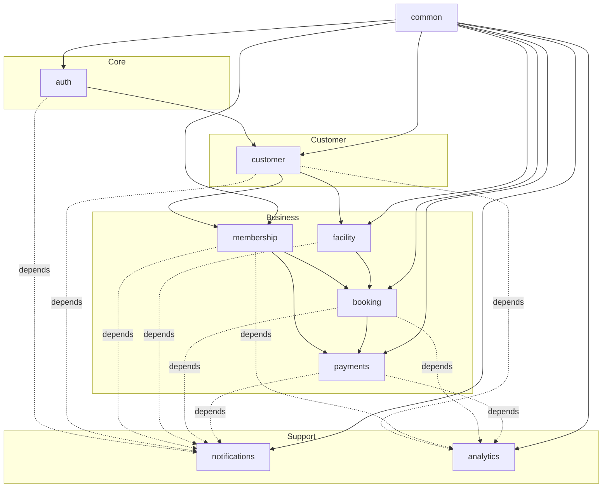

# Modules Overview

> Module map, dependency rules, and how to add a new module.

This document defines the module structure of the Splashh backend. Each module is a bounded context with clear ownership, public APIs, and boundaries.

---

## Module Map



---

## Module List

| Module | Purpose | Owner |
|---|---|---|
| [auth](./auth.md) | Identity, authentication, sessions | Security |
| [customer](./customer.md) | Member profiles, guardians, waivers | Customer Team |
| [membership](./membership.md) | Plans, subscriptions, renewals | Billing Team |
| [facility](./facility.md) | Courts, pools, resources, availability | Operations Team |
| [booking](./booking.md) | Reservations, slots, check-in | Operations Team |
| [payments](./payments.md) | Invoices, payments, refunds | Billing Team |
| [notifications](./notifications.md) | Email, SMS, push notifications | Platform Team |
| [analytics](./analytics.md) | Reports, dashboards, exports | Product Team |
| [common](./common.md) | Shared utilities, base classes | All |

---

## Dependency Rules

> **Rule** — Dependencies must point downward. No module may depend on a module "above" it.

```
Allowed:    auth -> common
Allowed:    customer -> auth
Allowed:    customer -> common
Forbidden:  common -> auth
Forbidden:  auth -> customer
```

### Dependency Direction

| From | To (Allowed) |
|---|---|
| auth | common |
| customer | auth, common |
| membership | customer, common |
| facility | common |
| booking | customer, facility, common |
| payments | booking, membership, common |
| notifications | (all modules) |
| analytics | (all modules) |

---

## Module Structure

Each module follows this structure:

```
module_name/
├── __init__.py          # Public API exports
├── router.py            # FastAPI routes
├── service.py           # Business logic
├── repository.py        # Data access
├── models.py            # SQLAlchemy models
├── schemas.py           # Pydantic schemas
├── events.py            # Domain events
├── exceptions.py        # Module-specific exceptions
└── tests/
    ├── __init__.py
    ├── test_service.py
    └── test_integration.py
```

---

## How to Add a New Module

### Step 1: Design

1. Define the bounded context
2. Identify aggregates and entities
3. Define public APIs (interfaces)
4. Identify events
5. Map dependencies

### Step 2: Create

1. Create folder in `app/`
2. Implement structure per above
3. Add to dependency rules
4. Create database migration

### Step 3: Register

1. Add router to main app
2. Add to module list in this document
3. Add to dependency tests
4. Document in handbook

### Step 4: Review

1. Architecture review by Architect Agent
2. Security review if sensitive
3. Peer review by module owner

---

## Common Module

The `common` module contains shared utilities used by 3+ modules:

> **Rule** — Only add to common if used by 3+ modules.

Contents:
- Base entity/repository/service classes
- Pydantic mixins
- Error types
- Audit logging
- Tenant context

Do NOT add to common:
- Business logic
- Module-specific utilities
- Things used by only 1-2 modules

---

## Related Documents

- [Bounded Contexts](../03-domain/bounded-contexts.md)
- [Aggregates](../03-domain/aggregates.md)
- [Backend Structure](../04-backend/folder-structure.md)
- [Module Structure](../04-backend/module-structure.md)
